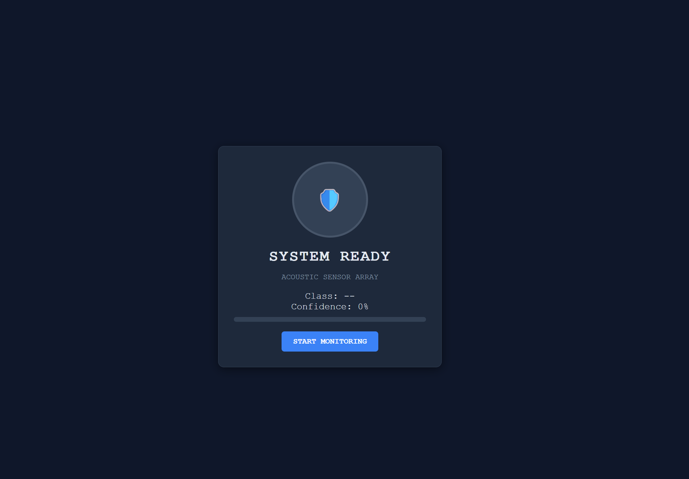

# DroneGuard: Acoustic UAS Detection System


*> **Note:** Above is a capture of the live dashboard identifying a Class 1 UAS threat in a simulated environment.*

## 📋 Project Overview
**DroneGuard** is a hybrid AI-powered acoustic detection system designed to identify and classify Class 1 Uncrewed Aerial Systems (UAS) in real-time.

Built during the **Ottawa Defence Hackathon 2025**, this prototype addresses the critical challenge of detecting "Low, Slow, and Small" (LSS) aerial threats that often evade traditional radar cross-sections.

By leveraging **Transfer Learning** on the YAMNet architecture, DroneGuard acts as a "Shazam for Drones," distinguishing between ambient environmental noise (wind, traffic, birds) and specific drone motor harmonics in cluttered urban environments.

---

##  Tactical Value: Why This Matters on the Modern Battlefield

As seen in recent conflicts, the battlefield is increasingly saturated with low-cost, commercial-off-the-shelf (COTS) drones used for reconnaissance and kinetic strikes.

### The Challenge
* **Radar Blindspots:** Class 1 UAS are often too small to generate a reliable radar return, or they fly below the radar horizon in "cluttered" environments like urban centers or heavy foliage.
* **Electronic Warfare (EW) Limitations:** RF detection relies on the drone communicating with a controller. "Dark" drones flying on pre-programmed paths emit no radio signals, rendering RF detection useless.

### The DroneGuard Solution
**Acoustic Signature Intelligence (ACINT)** serves as the fail-safe layer in a multi-sensor defense grid.
* **Passive Sensing:** Unlike active radar, this system emits no signals, allowing it to operate without revealing the defender's position.
* **Non-Line-of-Sight (NLOS) Detection:** Audio waves diffract around buildings and terrain, allowing DroneGuard to hear threats before they are visible.
* **Cost Asymmetry:** Deploys on standard commercial hardware (microphones/laptops), offering a low-cost countermeasure to low-cost threats.

---

## Tech Stack & Architecture

This system utilizes a **Microservices Architecture** to separate high-performance AI inference from robust mission management.

| Component | Technology | Role |
| :--- | :--- | :--- |
| **The Brain (AI)** | **Python 3.9+ / TensorFlow** | Performs spectral analysis and executes the YAMNet inference engine via a FastAPI wrapper. |
| **The Commander** | **Java 20 / Spring Boot** | Manages sensor state, handles user alerts, and logs threat history using Spring WebFlux. |
| **The Interface** | **HTML5 / CSS3 / JS** | Provides real-time visualization of confidence levels and threat status. |

---

##  Deployment Instructions

### Prerequisites
* **Java 20** (or JDK 17+)
* **Python 3.9+**
* **Maven**
* **FFmpeg** (Required for processing live microphone audio on Windows)

### Step 1: Ignite the AI Engine (Python)
1.  Navigate to the AI directory:
    ```bash
    cd drone-ai-python
    ```
2.  Create and activate the virtual environment:
    ```bash
    # Create (One time)
    python -m venv venv

    # Activate (Windows)
    .\venv\Scripts\activate
    
    # Activate (Mac/Linux)
    source venv/bin/activate
    ```
3.  Install dependencies:
    ```bash
    pip install -r requirements.txt
    ```
4.  Start the Neural Network Microservice:
    ```bash
    uvicorn main:app --reload --port 8000
    ```
    *Status: Listening on Port 8000*

### Step 2: Launch the Command Center (Java)
1.  Open a new terminal and navigate to the backend:
    ```bash
    cd drone-backend-java
    ```
2.  Run the Spring Boot application:
    ```bash
    mvn spring-boot:run
    ```
    *Status: Command Center Active on Port 8080*

### Step 3: Operational Use
1.  Open a web browser (Chrome/Edge recommended).
2.  Navigate to **`http://localhost:8080`**.
3.  Click **"START MONITORING"**.
4.  **Simulate Threat:** Play audio of a generic DJI Phantom or Quadcopter into your microphone. The system will trigger a **RED** alert state upon positive identification.

---

## License & Acknowledgments
Developed for the **Ottawa Defence Hackathon**.

* **Dataset:** Provided by AVSS / Challenge Organizers.
* **Model:** YAMNet (Google Research).
* **Team:** [Your Team Name / Your Name]


